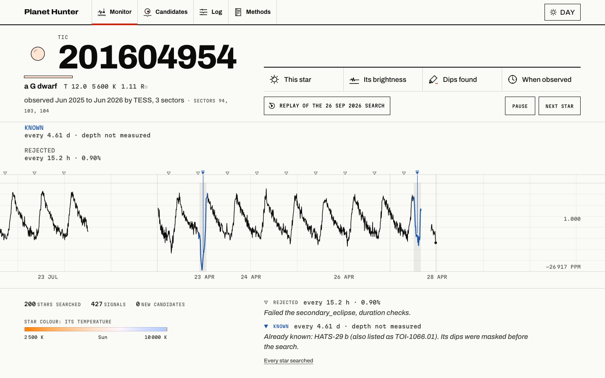
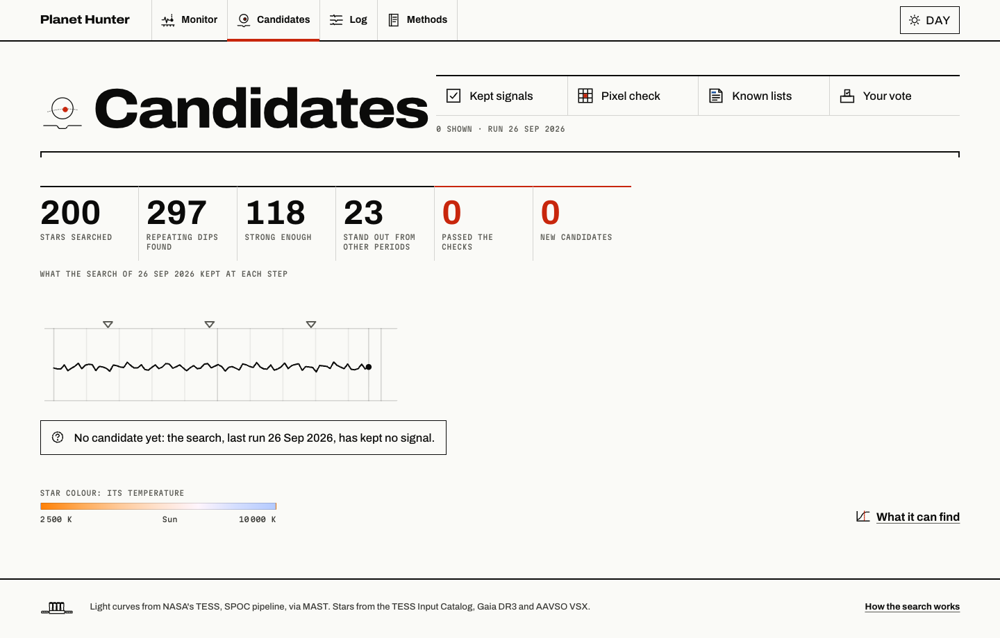
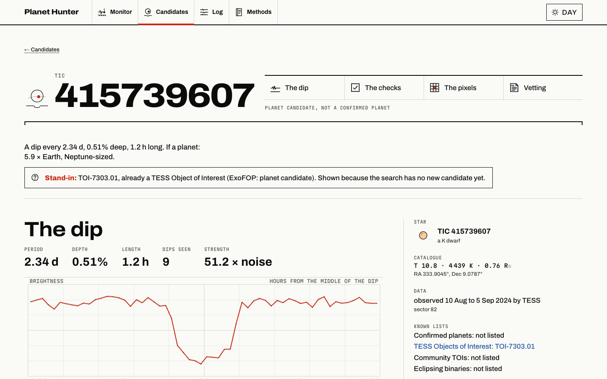
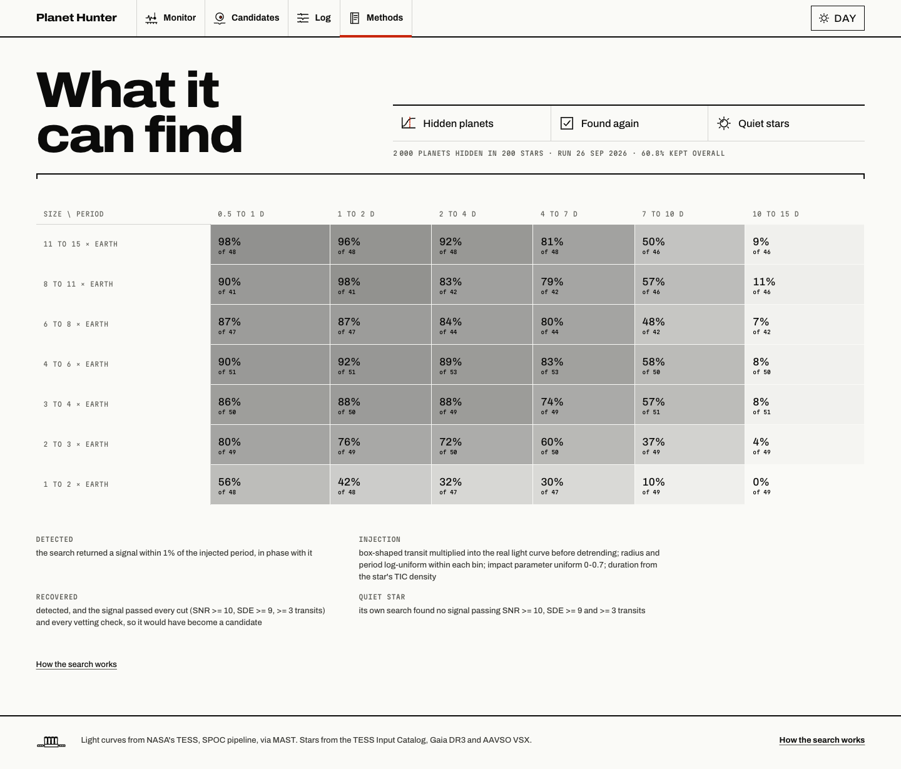
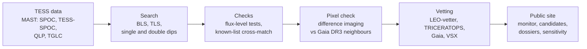

# planet-hunter

**An open-source search of public NASA TESS data for planet candidates. Every star it checks, every signal it throws out, and the reason why are shown in public.**

<!-- Screenshots: SHIP adds the real images at these paths. -->
| | |
|---|---|
|  |  |
|  |  |

## What it does

planet-hunter downloads light curves from NASA's TESS space telescope (a record of each star's brightness over time) and looks for small dips that repeat, the way a star dims when a planet passes in front of it. Every signal it finds goes through a series of automatic checks that catch the usual impostors: two stars eclipsing each other, a variable star nearby, or a glitch on the spacecraft. The signals that survive then get a pixel-level check of whether the dip really comes from the target star and not from a neighbour. A public website shows the search working through its star list, along with the evidence behind each candidate and a plain statement of what the search can and cannot find. A signal that passes everything is called a **candidate**: not a planet, and not a discovery.

## How it works

1. **TESS data.** Light curves come from MAST, NASA's public archive at STScI: SPOC 2-minute, TESS-SPOC and QLP, plus TGLC for faint stars. Stars down to TESS magnitude 13 are ranked so that small, cool, quiet stars observed in many sectors come first, because a planet blocks a larger share of a small star's light.
2. **Search.** Each light curve is cleaned and flattened, then searched for repeating box-shaped dips with Box Least Squares. The deep version adds Transit Least Squares and a search for long-period planets that show only one or two dips. Planets already known on a star are masked out first, so the search only looks for extra ones.
3. **Checks.** Each signal must clear signal-to-noise and periodogram cuts and show at least three dips. It then has to pass every check (odd/even depths, secondary eclipse, size, period aliases, spacecraft momentum dumps, depth from sector to sector, transit duration against the star's density). Last, it is cross-matched against the lists of confirmed planets, TOIs, CTOIs and eclipsing binaries.
4. **Pixel check.** A TESS pixel is 21″ wide, so a nearby eclipsing binary can leak into the target's light. Difference imaging finds where on the sky the light went missing during the dip. That spot is compared with the target and with every Gaia DR3 neighbour, which gives one of four verdicts: *on target*, *possible neighbour*, *off target* or *inconclusive*.
5. **Vetting.** Published community tools (LEO-vetter, TRICERATOPS, Gaia DR3 binarity and neighbour tests, AAVSO VSX) give each candidate a *pass*, *flag* or *fail*. A tool that could not run is always shown as a flag, never as a pass.
6. **Public site.** An API stores the candidates, their pixel checks and vetting, and people's reviews. The website replays the search star by star and shows the candidate list, each candidate's full dossier, the search log and the sensitivity map.



Diagrams of every part, with what is built and what is planned, are in [docs/architecture/ARCHITECTURE.md](docs/architecture/ARCHITECTURE.md).

## What makes it scientific

- **Measured sensitivity.** Fake planets are injected into real light curves and put through the same search, checks and cuts. The site shows the share recovered by planet size and orbital period, including the ranges where the search fails.
- **Published vetting tools.** Where community tools exist, the project uses them rather than its own versions, so a professional vetter sees numbers they already trust. These are LEO-vetter (Kunimoto et al. 2025), TRICERATOPS (Giacalone & Dressing 2020), difference imaging after Bryson et al. 2013, Gaia DR3 RUWE and non-single-star orbits, and AAVSO VSX. The project's own pixel check is tested against cases with a known answer from the TESS follow-up team (TFOP).
- **Catalogue cross-matching.** Every signal is compared with NASA Exoplanet Archive confirmed planets, ExoFOP TOIs and CTOIs, and the TESS eclipsing-binary catalogue (Prša et al. 2022). A match counts at the same period within 1% or at ×2, ×3, ½ or ⅓ of it, on the star itself or on any listed star within 2.5′. The lists are snapshotted once per sweep, and every open candidate is checked again at each ingest.
- **Honesty rules, enforced in code.**
  - The words "discovered" and "new planet" are banned. The API rewrites them and the tests scan every response for them.
  - A check that could not run is never counted as passed.
  - Rejected signals stay visible, each with its reason.
  - Demo data and stand-ins carry a label, and a replay is never shown as live.
  - The site shows both when the telescope took the data and when the search looked at it.
  - Candidates are not uploaded to ExoFOP until they appear in a refereed paper. ExoFOP has required this since 19 August 2026.

## Honest results so far

**No candidate has reached a public site yet: nothing is deployed.** Everything below was run locally or in the
server dry run.

- **Stars searched.**
  - The fast search ran on the top 200 stars of the 26 Sep 2026 target list. It found 297 signals. 23 passed the signal-to-noise, periodogram and three-dip cuts, and all 23 failed at least one check (duration 22, sector depth 16, secondary eclipse 10, period alias 7, odd/even 5; a signal can fail several).
  - The deep search had a calibration run on 360 stars, run twice. It produced no periodic or double-dip candidates, one single-dip candidate in the first run and none in the second.
  - The two samples come from lists ranked in different ways, so they may overlap.
  - The server dry run (27 Sep 2026) searched 20 real stars through all three queues. It found 55 signals and 1
    candidate: a single dip on TIC 389051009 (SNR 28.8). It has no period and has not been reviewed.
  - The target lists hold 730,692 stars at Tmag ≤ 13, and 2,993,304 faint M dwarfs at Tmag 13–16 for TGLC.
- **What it recovers.**
  - **Injection-recovery** (fast search, 200 quiet stars, 2,000 fake planets): 61% recovered overall. By size: 28% at 1–2 R⊕, 55% at 2–3 R⊕, 66–72% above 3 R⊕. By period: 82–84% under 2 d, 45% at 7–10 d, 7% at 10–15 d.
  - **Known objects found again:**
    - TOI-7303.01: found, then correctly filtered out as already known.
    - TOI-813 b (P = 83.9 d): recovered from 42 stitched sectors.
    - TOI-2180 b (P ≈ 261 d): its single transit gives a period range that contains the true period.
    - TOI-5688 A b: recovered on faint-star TGLC data.
    - An injected 1.6 R⊕ planet on a quiet M dwarf: recovered as a full candidate.
  - **Pixel check:** WASP-18 b is *on target*. TOI-4257.01 is *off target*, and the check points to the same neighbour, TIC 75208617, that TFOP named when it ruled the signal a false positive.
- **Known limits.**
  - At 10–15 d, 77% of injected planets are *detected* but only 7% pass every cut. Most are lost to the SDE cut. This is the next thing to fix.
  - Planets under 2 R⊕ are mostly missed. So are stars fainter than Tmag 13, except on the faint branch, and stars with no TIC radius, because their size and duration checks cannot run.
  - The deep search's own sensitivity has not been measured yet. The numbers above are from the fast search.
  - On stitched multi-year curves, TLS fits its time budget only on the newest ~2 sectors. BLS covers the whole baseline.
  - The search missed TOI-1680 b on TGLC data even though the transit is in the data (SNR ≈ 24). The cause is diagnosed: the coarse search adds up per-sector power without keeping phase.
  - The vetting flags WASP-18 b and fails WASP-126 b, both confirmed planets. LEO's SWEET test picks up WASP-18 b's real phase curve. LEO's odd/even test trips on a 2.7% difference in WASP-126 b because it has no fractional floor. Automated vetting is a filter, not a verdict.
  - The pixel check's Gaussian PSF measures depths ~15% low.
  - No automatic check can rule out an eclipsing binary sitting almost directly behind the target. That takes sharper images or spectra from the ground.
  - The single-dip false-alarm rate rests on 0–1 events in 359 stars.

## Status

| Part | Folder | State |
|---|---|---|
| Science pipeline for one star (`hunter`) | `pipeline/` | Built (v2) |
| Fast search: newest ≤ 3 sectors, BLS 0.5–15 d | `hunt/` | Built (v2) |
| Deep search: all sectors, long-period BLS, TLS, single and double dips | `hunt/` on branch `deephunt` | Built, not merged |
| Pixel check (`skypixels`) | `pixels/` | Built (v2) |
| Vetting with published tools (`skyvet`) | `vet/` on branch `vet` | Built, not merged. Run on every candidate by the runner (dry-run tested) |
| Faint M dwarfs with TGLC (`skyfaint`) | `faint/` on branch `faint` | Built, not merged. Searched by the runner's faint queue (dry-run tested) |
| API: candidates, votes, pixel checks, monitor, ExoFOP export | `api/` | Built (v2) |
| Website: finder pages | `web/` | Built (v2) |
| Website: the chart-recorder monitor, dossiers, log, methods | `web/` | Built; mock mode replays real recorded data, live mode reads the API |
| CI: tests of every package on GitHub-hosted runners | `.github/workflows/ci.yml` | Built |
| Daily search on one Oracle Cloud Always Free server: systemd timer, ledger, fast / deep / faint queues, live monitor posts with each star's record, vetting, merge, ingest | `runner/` | Built and dry-run tested (Ubuntu 24.04 arm64 container, 20 real stars, 27 Sep 2026). Not deployed |
| GitHub Actions search workflows (`sweep.yml`, `finder.yml`) | | Removed on 27 Sep; the runner does the search |
| Hosting: Render (API), Supabase (Postgres), Vercel (web), the Oracle server | `render.yaml`, `api/Dockerfile`, [docs/DEPLOY.md](docs/DEPLOY.md) | Written, not deployed |
| One branch with everything the server runs | `release` | v2 + monitorui + vet + faint + runner merged; deephunt's final not merged yet |
| Structured public flags, two-person review, refereed paper, ExoFOP upload | | Planned |

## Tech stack

- **Science (Python 3.12, uv):**
  - astropy for BLS, lightkurve, astroquery, NumPy, SciPy;
  - wotan for detrending, transitleastsquares, tess-point;
  - LEO-vetter, TRICERATOPS and transit-diffImage for vetting.
- **API:** FastAPI, Pydantic, psycopg 3. Postgres in production, SQLite for development and tests, and every storage test runs on both.
- **Web:** Next.js 16 (App Router), React 19, TypeScript, tested with `node --test`.
- **Automation:** the daily search runs on an Oracle Cloud Always Free server (Ampere A1, 4 cores, 24 GB, Ubuntu 24.04 arm64) under systemd, with a standard-library Python scheduler and a SQLite ledger (built and dry-run tested, not deployed). GitHub Actions is for CI.

## Run locally

Each Python folder is its own uv project, and every test suite runs offline on recorded real TESS data.

```bash
# Search one star with the single-star pipeline
cd pipeline && uv sync && uv run python -m hunter WASP-18 --max-sectors 2 --out out/

# Build the ranked target lists, then search a slice of them
cd hunt && uv sync
uv run hunt targets --out targets
uv run hunt run --tic-file targets/targets.csv --shard 0/20 --time-budget-min 30 --out shard0
uv run hunt merge shard0/ --tic-file targets/targets.csv --out merged
uv run pytest

# Pixel check of one signal (WASP-18 b)
cd pixels && uv sync
uv run skypixels vet --tic 100100827 --period 0.9414525 --t0 3205.353322 --duration 2.05 --out out/wasp18

# API on :8000 (SQLite; interactive docs at /docs), then load a sweep's output
cd api && uv sync && uv run pytest -q
uv run uvicorn --factory api.app:create_app
uv run --extra finder python -m api.finder_ingest --dir ../merged/candidates --run-id local

# Website on :3000 (demo data by default; NEXT_PUBLIC_API_MOCK=false and NEXT_PUBLIC_API_BASE for a real API)
cd web && npm install && npm run dev
```

Each folder's README documents every threshold and option: [pipeline](pipeline/README.md), [hunt](hunt/README.md), [pixels](pixels/README.md), [api](api/README.md), [web](web/README.md).

## Data credits and licences

**Code:** MIT, see [LICENSE](LICENSE). Data, images and fonts keep their own licences, listed below.

- **TESS.** This project uses data collected by the TESS mission, obtained from MAST at the Space Telescope Science Institute. Funding for the TESS mission is provided by NASA's Science Mission Directorate. SPOC light curves and target pixel files are public; see the [MAST data-use policy](https://archive.stsci.edu/publishing/data-use).
- **High-level science products:** TESS-SPOC (Caldwell et al. 2020), QLP (Huang et al. 2020; Kunimoto et al. 2021) and TGLC (Han & Brandt 2023). All three are CC BY 4.0.
- **TESS Input Catalog** v8.2 (Stassun et al. 2019).
- **Gaia DR3** (Gaia Collaboration, Vallenari et al. 2023): data from the ESA mission *Gaia*, processed by the Gaia DPAC. Gaia data are licensed **CC BY-NC 3.0 IGO**, which means **non-commercial use only**, and this project stays non-commercial.
- **NASA Exoplanet Archive:** this research has made use of the NASA Exoplanet Archive, which is operated by the California Institute of Technology, under contract with NASA under the Exoplanet Exploration Program.
- **ExoFOP-TESS** TOI and CTOI tables; the **TESS eclipsing-binary catalogue** (Prša et al. 2022); **AAVSO VSX**; **CDS** VizieR and xMatch.
- **Pictures on the site:** each has its own credit and licence in [`web/public/images/credits.json`](web/public/images/credits.json), and all are listed on the site's `/credits` page. They include DESI Legacy Surveys, Pan-STARRS1, SkyMapper, ESO, NASA/ESA Hubble and NASA SDO images.
- **Fonts and icons:** Geist, Newsreader and Martian Mono (SIL Open Font License 1.1), and Phosphor Icons (MIT).
- **Tools:** each tool keeps its own licence. LEO-vetter is GPL-3.0 and is installed as a dependency, not copied into this repository. TRICERATOPS, transitleastsquares and wotan are MIT.

To cite this project, see [CITATION.cff](CITATION.cff).

---

Designed and directed by Foivos Anastasiadis; code written with Claude Code.
