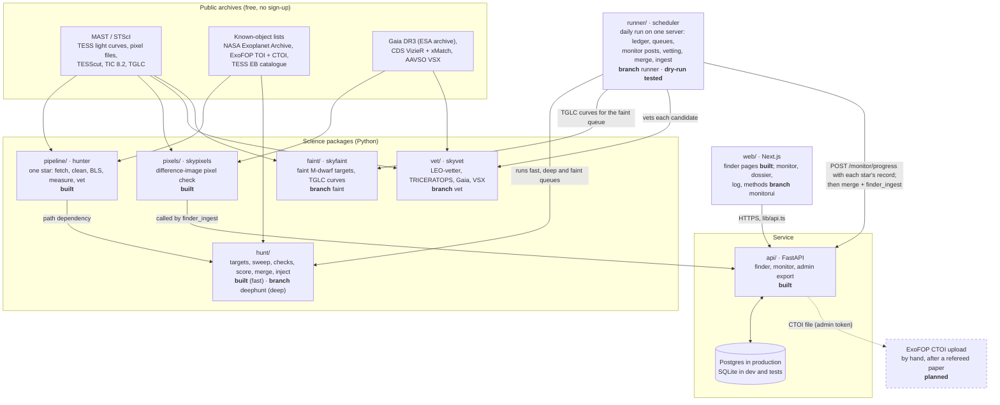
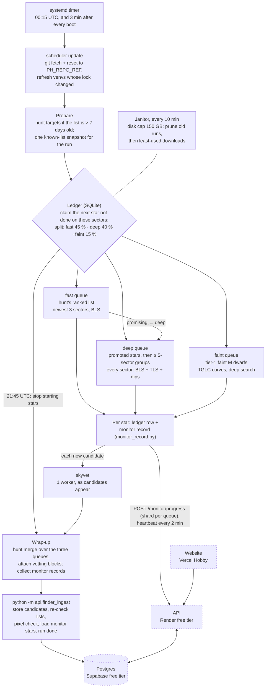
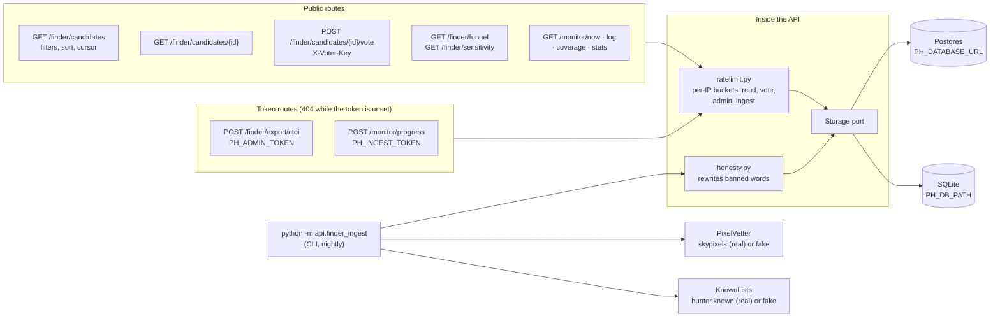
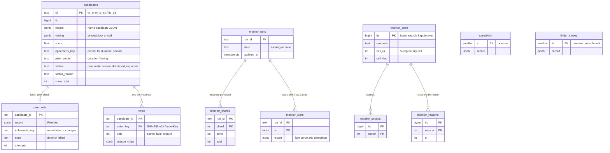
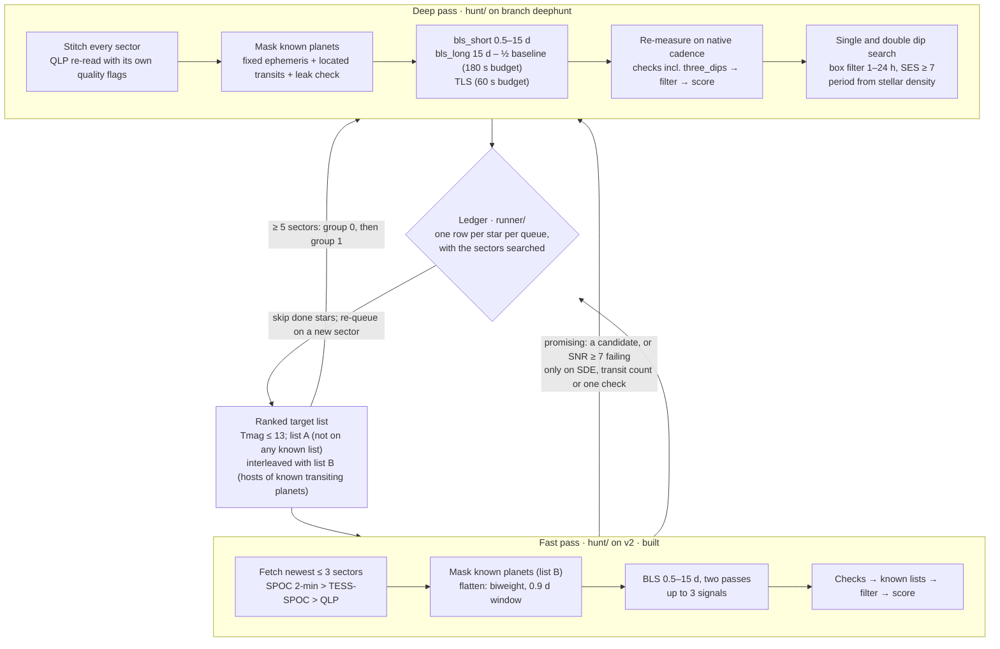
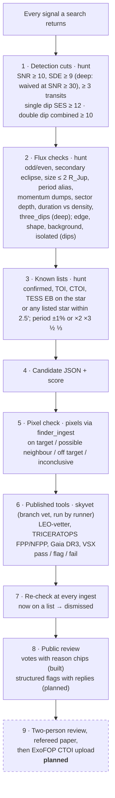

# Architecture

How planet-hunter is put together, from the TESS archive to the public site. Every diagram follows the code on
`origin/v2` and on the feature branches named below. Anything not built yet is marked **planned** and drawn with a
dashed border; built code whose hosting is not set up yet is drawn dotted.

Status words used throughout:

| Word | Meaning |
|---|---|
| **built** | on `v2`, with tests |
| **branch** | built and tested on a feature branch (`deephunt`, `vet`, `faint`, `monitorui`), not merged into `v2` yet |
| **dry-run tested** | built on branch `runner` and proven end to end: `runner/deploy.sh` installed it on a fresh Ubuntu 24.04 arm64 container, which searched 20 real TESS stars and ingested into Postgres (27 Sep 2026). **Not deployed** to the real server yet |
| **written** | the file exists but is not installed or running (the GitHub Actions workflows) |
| **not deployed** | the code is built, but the hosting it targets (Oracle server, Render, Supabase, Vercel) is not set up yet; drawn dotted |
| **planned** | a decision in `docs/plan/ROADMAP.md` (branch `finder-plan`) or `docs/plan/PRODUCT.md`, with no code yet |

Contents:
1. [System overview](#1-system-overview)
2. [Nightly data flow on the Oracle server](#2-nightly-data-flow-on-the-oracle-server)
3. [API and database](#3-api-and-database)
4. [The two-speed search](#4-the-two-speed-search)
5. [Vetting stages](#5-vetting-stages)

---

## 1. System overview

**In plain English.** Everything starts from public archives. `pipeline/` knows how to search one star. `hunt/` uses
it to work through hundreds of thousands of stars, adds the extra checks and the known-object filtering, and writes
one JSON file per candidate. `vet/` adds a vetting block from published tools to a candidate, and `faint/` finds
faint M dwarfs and loads their TGLC light curves. `runner/` ties them together on one server: every day it works
through three queues of stars, posts each finished star to the API's live monitor, vets each candidate, then merges
the day's output and runs the ingest. The API loads the candidates into a database, runs the pixel check (`pixels/`)
on them, and serves them to the website. `deephunt`, `vet`, `faint`, `monitorui` and `runner` are still separate
branches; the runner's dry run used a local merge of `v2 + deephunt + vet + faint + runner`. Nothing goes to ExoFOP
automatically: the API can produce the upload file, but the owner uploads it by hand, and only after a refereed
paper.

Each Python folder is its own uv project, and each is tested offline on recorded real TESS data. The API never
imports the science stack at web-request time. `pixels/` and `hunter` are an optional extra (`--extra finder`) used
only by the ingest command, so the web API's deploy stays small.

---

## 2. Nightly data flow on the Oracle server

> **Built and dry-run tested, not deployed.** `runner/` (branch `runner`) runs the daily search on an **Oracle Cloud
> Always Free server** (Ampere A1, 2 cores, 12 GB, Ubuntu 24.04 arm64) on its own systemd timer. It is not a GitHub
> runner: the server pulls the public repository read-only over HTTPS, and only SSH is open. On 27 Sep 2026 the whole
> install and a real run were proven in an Ubuntu 24.04 arm64 container (below). The real server is not provisioned
> yet, and the API, database and website are not hosted yet (dotted boxes).

**In plain English.** Once a day the timer starts a run, named `oracle-YYYYMMDD`. The server first updates itself
to the tip of its branch, refreshes the ranked star list when it is a week old, and snapshots the known-object lists
so every star that day is checked against the same lists. One worker process per core (two on the free
instance) then searches until 21:45 UTC, one star each. A SQLite **ledger** records every star per queue with the sectors it was searched on, so the server moves
down the list day after day, retries a failed star up to three times, and searches a star again only when a new
sector of it becomes public. Claiming a star is a single SQL statement, and after a crash or reboot the run resumes
without repeating a finished star.

Three queues share the workers by a target share of the day's worker time:
- **fast** (45 %) goes down hunt's ranked list with the cheap 3-sector search;
- **deep** (40 %) takes first the stars the fast pass flagged as **promising** (a candidate, or a periodic signal at
  SNR ≥ 7 that failed only on SDE, the transit count or one check), then the bright quiet stars with ≥ 5 sectors,
  then all other ≥ 5-sector stars;
- **faint** (15 %) searches faint M dwarfs on TGLC light curves, for public candidates only (roadmap decision 4).

Each finished star is posted to `POST /monitor/progress` with its **monitor record**: star parameters, sectors,
observation dates, the searched light curve normalised per sector and binned (30 min, wider on long baselines so it
stays under 2,000 points), every detection with its outcome (`candidate`, `known` or `rejected`) and reason, and the
star's outcome. hunt does not write these records; the runner builds them from hunt's per-star result. A heartbeat
every 2 minutes keeps the site's monitor **Live** while long stars run. Posting never blocks the search: if the API
is down, the search carries on. Each candidate is vetted by `skyvet` on one worker as soon as it appears.

At wrap-up, `hunt merge` combines the three queues (ranking, the funnel, and the nearby-stars artefact test for
single and double dips), the vetting blocks are attached, and `finder_ingest` writes everything to Postgres: it
stores the candidates, pixel-checks them, dismisses any that are now on a known list, loads every star's monitor
record for the replay, and marks the run done. A janitor keeps the data under 150 GB.

**Dry run, 27 Sep 2026** (`runner/dryrun/results_2026-09-27.json`): `deploy.sh` → `bootstrap.sh` on a fresh Ubuntu
24.04.5 arm64 container with systemd, SSH and 4 CPUs, posting to a local copy of the API on Postgres 16.

| Queue | Stars searched | Mean s per star per worker | Stars per hour on 4 workers |
|---|---|---|---|
| fast | 14 | 36.2 | 398 |
| deep | 11 (6 group-0, 5 promoted by the fast pass) | 270.1 | 53 |
| faint | 6 | 218.1 | 66 |

The monitor was live for the whole search (44 of 44 polls), with 103 posts and none failed. The run found 55
signals and 1 candidate, a single dip on TIC 389051009 (SNR 28.8). It has no period, so skyvet and the pixel check do
not apply. The ingest stored it and marked the run done, and after a reboot the timer's start exited at once because
the day's run was done. The caches were cold, the samples small, and the host a shared laptop; Ampere cores are
slower per core.

**Not built or not done yet:**
- the real Oracle server (the runner is installed with `runner/deploy.sh <ip> <key> --ref main` once it exists);
- hosting for the API (Render), database (Supabase) and website (Vercel): written in `render.yaml`, `api/Dockerfile`
  and [docs/DEPLOY.md](../DEPLOY.md), not deployed;
- deephunt's final `hunt/` on the release branch.

**Why not GitHub Actions.** Before the Oracle decision, the nightly flow was written for GitHub Actions
(`hunt/ci/sweep.yml` and `api/ci/finder.yml`); both were removed on 27 Sep and the runner does the search.
`.github/workflows/ci.yml` runs only the tests. GitHub's terms for hosted runners exclude "activity unrelated to the
production, testing, deployment, or publication of the software project", which is why the bulk search moved off
them (SCIENCE.md §9 on branch `finder-plan`).

---

## 3. API and database

**In plain English.** The API is small on purpose: it stores what the search produced and serves it. Web requests
only read and write the database. The slow science (pixel checks, re-checking the known lists) happens in the
nightly `finder_ingest` command, behind two ports with a fake and a real implementation (`PH_ADAPTERS=fake|real`),
so the tests never touch the network. There are no accounts. A vote is tied to a random key made by the browser,
and only its SHA-256 is stored. Every stored string goes through the honesty rule, and every test response is
scanned for "discovered" and "new planet". The export route refuses candidates whose pixel check says *off
target*, and single or double dips, which have no period for ExoFOP.

**Tables** (migrations `0005_finder` and `0006_finder_only`, identical for Postgres and SQLite):

**Candidate life cycle.** `new` → first vote → `under review` (back to `new` if every vote is withdrawn). An open
candidate that turns up on a TOI, CTOI, confirmed-planet or EB list at a later ingest becomes `dismissed`, with the
match as its reason. The admin export marks a candidate `exported`, and an exported candidate is never dismissed. The
ephemeris key ties each pixel check to the period, epoch, duration and sectors it ran on. If the search refines any of
these, the candidate is pixel-checked again.

**Live or replay.** `GET /monitor/now` answers `live` while a run is `running` and a shard has posted within 15
minutes. Otherwise it answers `replay`: the newest finished run, one star every 20 s of server time (star number
`floor(unix_time / 20) mod stars`), so every visitor sees the same star at the same moment. A replay is always
labelled as one.

---

## 4. The two-speed search

Two modes of the same `hunt/` package. The **fast pass** is the search on `v2`; the **deep pass** is branch
`deephunt`'s rewrite, which uses every sector (with deephunt's hunt, the fast pass is the same code with the deep and
dip searches switched off). `runner/` runs both as queues, promotes promising stars from the fast pass to the deep
pass, and keeps the ledger in between (branch `runner`, **dry-run tested**).

**In plain English.** The fast pass looks at the newest three sectors of a star for orbits up to 15 days. It is
cheap and can cover the whole list within a few nights. Many TESS stars have been observed in five or more sectors
across several years. Joining all of them makes long orbits and small planets visible, but it costs about ten times
more per star. So the deep pass is kept for the stars where it adds most: the ones the fast pass found promising,
and the stars with five or more sectors, brightest and quietest first. The fast pass skips a star the deep pass
already searched on the same sectors. It also finds planets that show only one
or two dips. For those it estimates a period range from the dip's length and the star's density, and it scores them
lower than repeating signals.

| | Fast pass | Deep pass |
|---|---|---|
| Data | newest ≤ 3 sectors | every sector, stitched (median 6 in calibration, up to 42 in tests) |
| Periods | 0.5–15 d | 0.5 d to half the baseline, plus single and double dips |
| Methods | BLS | BLS (short and long grids), TLS, box matched filter for single dips |
| Time per star (measured) | median 26 s with download, 18 s of search (20-star benchmark); mean 36 s in the runner dry run | median 216 s, mean 237 s (360-star calibration); mean 270 s in the runner dry run |
| Share of the day (runner) | 45 % | 40 % (faint queue: 15 %) |
| Star timeout | 5 min | 15 min |
| Sensitivity | measured: 61% of 2,000 injections recovered | not measured yet (ROADMAP Phase 1b) |

Both use the same rule for known hosts. Every listed signal on a star (confirmed, TOI, CTOI, EB) is masked before the
search. The mask is laid three ways: around predicted times, around the transits actually found near them (this
follows timing variations), and at the period where a known planet still leaks through. TOI-1130 c and TOI-181 b,
which leaked through the first sweep, are now tests.

---

## 5. Vetting stages

Cheap tests run on every signal, and slower, stronger tests run only on the survivors. A stage that could not run
never counts as a pass.

**In plain English.**
1. **Detection cuts** remove noise.
2. **Flux checks** catch most eclipsing binaries and spacecraft artefacts from the light curve alone. The funnel
   records the first stage each signal fails at: on the 26 Sep top-200 sweep, all 23 signals that passed the
   detection cuts failed a check here.
3. **Known lists** stop the project from re-announcing something already catalogued. For the deep pass, the merge
   step also rejects single and double dips that two or more nearby stars show at the same time, since that points to a sky or
   spacecraft artefact.
4. Survivors are written as candidate JSON files with a score.
5. **The pixel check** answers the most common false-positive question: is the dip on this star at all?
6. **skyvet** repeats the job with the community's own tools, so an outside vetter can trust the numbers. A tool that
   times out or cannot run gives a *flag*, never a *pass*.
7. **Every open candidate is re-checked** against the known lists at each ingest, so a TOI released after the search
   still dismisses it.
8. **Public review** lets people look at the evidence. Votes never change a candidate's status on their own.
9. **Planned:** two people review each candidate before a paper, and the paper comes before any ExoFOP upload.

**Tested on known answers.**

| Case | Pixel check | skyvet | Truth |
|---|---|---|---|
| WASP-18 b | on target | flag (LEO sees its real phase curve) | confirmed planet |
| TOI-4257.01 | off target, onto TIC 75208617 | fail (off target, 23″) | TFOP false positive, the same neighbour |
| TIC 408512382 | – | fail (too large, secondary eclipse) | eclipsing binary |
| WASP-126 b | – | fail (LEO odd/even, 2.7% apart at 3.2σ) | confirmed planet: a known limit of LEO's threshold |
| TIC 100101861, invented ephemeris | inconclusive | – | no signal there |

The last two rows are on purpose. The tests pin failures as well as successes, so a change that hides a limit shows
up as a failing test.

---

## Sources in the repository

| Topic | File (branch) |
|---|---|
| API routes, tables, configuration | `api/README.md`, `api/src/api/storage/migrations/` (v2) |
| Fast search, checks, score, sensitivity | `hunt/README.md`, `hunt/results/` (v2) |
| Deep search, single and double dips, calibration | `hunt/README.md` (deephunt) |
| Pixel check | `pixels/README.md` (v2) |
| Published-tool vetting | `vet/README.md` (vet) |
| Faint stars, TGLC | `faint/README.md`, `faint/INTEGRATION.md` (faint) |
| Monitor site, replay data | `web/docs/monitorui/README.md`, `web/public/data/monitor/README.md` (monitorui) |
| Decisions, roadmap, science plan, site plan | `docs/plan/ROADMAP.md`, `SCIENCE.md`, `PRODUCT.md` (finder-plan) |
| ExoFOP rules, throughput, data, methods text | `docs/plan/EXOFOP.md`, `THROUGHPUT.md`, `DATA.md`, `METHODS.md` (plan) |
| CI and deploy | `.github/workflows/ci.yml`, `api/Dockerfile`, `render.yaml`, `docs/DEPLOY.md` |
| Daily run on the server: ledger, queues, monitor records, dry run | `runner/README.md`, `runner/scheduler/`, `runner/systemd/`, `runner/dryrun/` |
