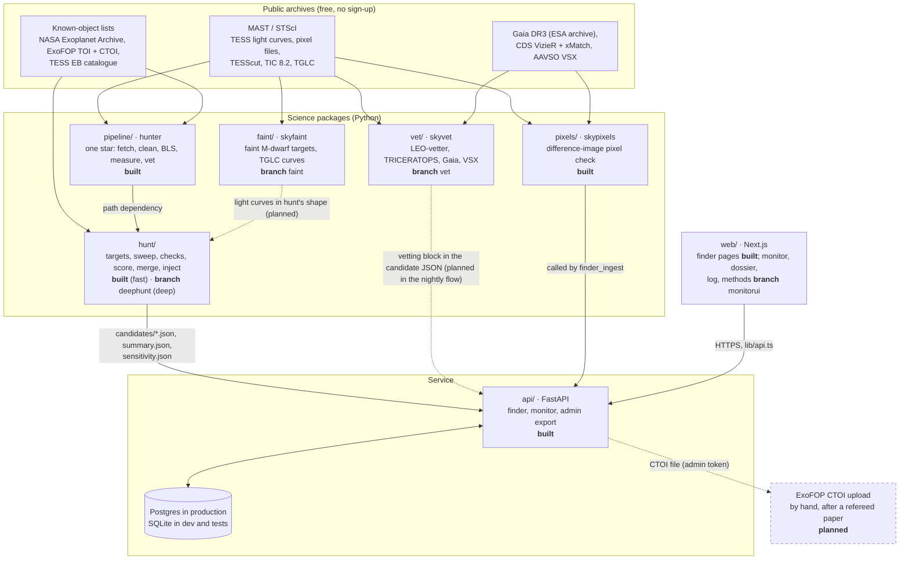
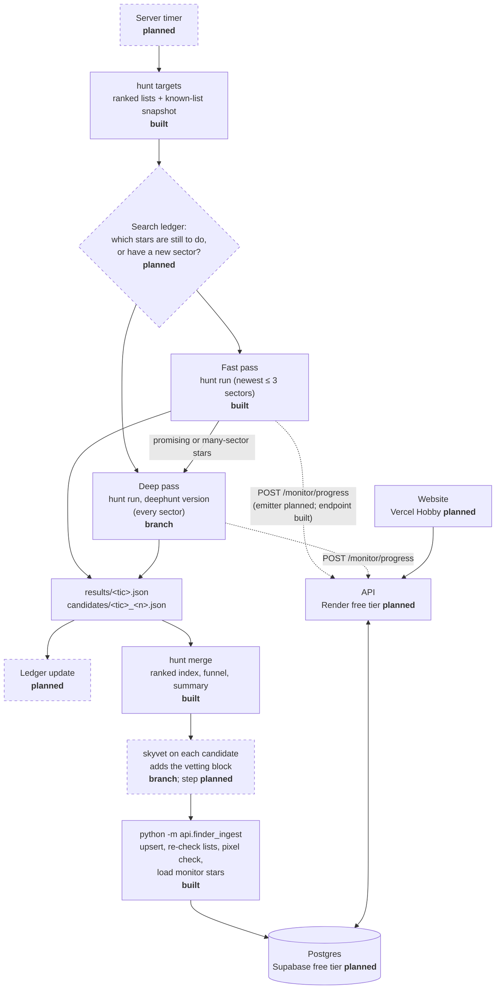
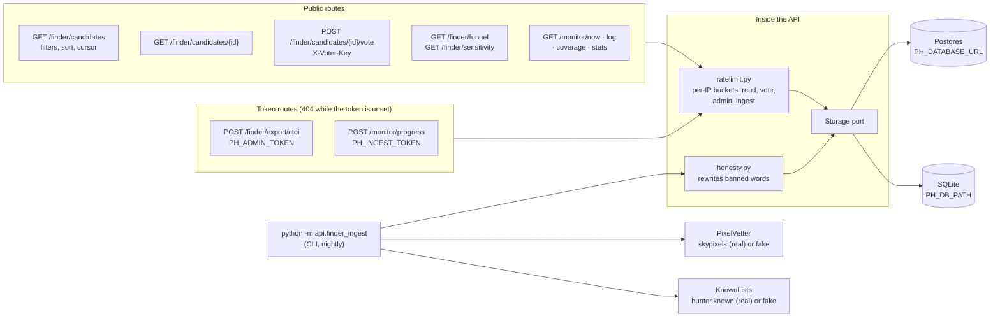
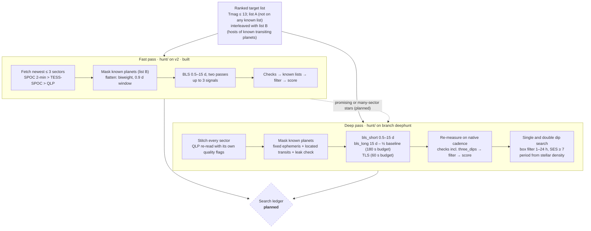
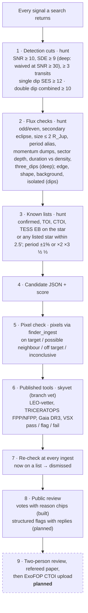

# Architecture

How planet-hunter is put together, from the TESS archive to the public site. Every diagram follows the code on
`origin/v2` and on the feature branches named below. Anything not built yet is marked **planned** and drawn with a
dashed border.

Status words used throughout:

| Word | Meaning |
|---|---|
| **built** | on `v2`, with tests |
| **branch** | built and tested on a feature branch (`deephunt`, `vet`, `faint`, `monitorui`), not merged into `v2` yet |
| **written** | the file exists but is not installed or running (the nightly workflows) |
| **planned** | a decision in `docs/plan/ROADMAP.md` (branch `finder-plan`) or `docs/plan/PRODUCT.md`, with no code yet |

Contents:
1. [System overview](#1-system-overview)
2. [Nightly data flow on the Oracle server](#2-nightly-data-flow-on-the-oracle-server)
3. [API and database](#3-api-and-database)
4. [The two-speed search](#4-the-two-speed-search)
5. [Vetting stages](#5-vetting-stages)

---

## 1. System overview

**In plain English.** Everything starts from public archives. `pipeline/` knows how to search one star. `hunt/` uses
it to work through hundreds of thousands of stars, adds the extra checks and the known-object filtering, and writes
one JSON file per candidate. The API loads those files into a database, runs the pixel check (`pixels/`) on new
candidates, and serves them to the website. `vet/` and `faint/` are finished packages on their own branches: `vet/`
adds a vetting block from published tools to a candidate (the API already has a column for it), and `faint/` finds
faint M dwarfs and loads their TGLC light curves. Neither is part of the nightly flow yet. Nothing goes to ExoFOP
automatically: the API can produce the upload file, but the owner uploads it by hand, and only after a refereed
paper.

Each Python folder is its own uv project, and each is tested offline on recorded real TESS data. The API never
imports the science stack at web-request time. `pixels/` and `hunter` are an optional extra (`--extra finder`) used
only by the ingest command, so the web API's deploy stays small.

---

## 2. Nightly data flow on the Oracle server

> **Mostly planned.** On 26 Sep 2026 the owner decided that the bulk search will run on an **Oracle Cloud Always
> Free server (4 cores, 24 GB)** on its own timer, with GitHub's hosted runners used for CI only (ROADMAP,
> "Decisions (26 Sep)"). No server code exists yet. The steps below reuse commands that **are** built (`hunt
> targets`, `hunt run`, `hunt merge`, `skyvet`, `python -m api.finder_ingest`). The dashed parts are new.

**In plain English.** Each night the server refreshes the ranked target list and snapshots the known-object lists,
so every star that night is checked against the same lists. A **search ledger** (planned) records which stars are
done with which sectors, so the server moves down the list instead of searching the top again. Today's code does not
do this yet: `hunt run` skips stars whose `results/` file exists, but nothing carries that folder from night to
night. The fast pass covers the list; the deep pass takes the promising and many-sector stars. `hunt merge` collects
the night's output. The planned vetting step adds `skyvet`'s block. `finder_ingest` then writes everything to the
database, pixel-checks up to 20 new candidates (within a 90-minute budget in the CI version), dismisses any candidate
that has since appeared on a known list, and loads the night's per-star records for the monitor's replay.

**What else is missing for the monitor.** The API side is built: `POST /monitor/progress` for live progress and
`finder_ingest --monitor-dir` for per-star records (`monitor/<tic>.json`: light curve, detections, outcome). Neither
version of `hunt run` writes those files or posts progress yet. The `monitorui` site runs today on a real replay of
the 26 Sep 2026 sweep, built by a one-off script.

**Why not GitHub Actions.** Before the Oracle decision, the nightly flow was written for GitHub Actions
(`hunt/ci/sweep.yml` and `api/ci/finder.yml`); both were removed on 27 Sep. `.github/workflows/ci.yml` runs only the
tests. GitHub's terms for hosted runners
exclude "activity unrelated to the production, testing, deployment, or publication of the software project", and
that is why the bulk search moved off them (SCIENCE.md §9 on branch `finder-plan`).

---

## 3. API and database

**In plain English.** The API is small on purpose: it stores what the search produced and serves it. Web requests
only read and write the database. The slow science (pixel checks, re-checking the known lists) happens in the
nightly `finder_ingest` command, behind two ports with a fake and a real implementation (`PH_ADAPTERS=fake|real`),
so the tests never touch the network. There are no accounts. A vote is tied to a random key made by the browser,
and only its SHA-256 is stored. Every stored string goes through the honesty rule, and every test response is
scanned for "discovered" and "new planet". The export route refuses candidates whose pixel check says *off
target*, and single or double dips, which have no period for ExoFOP.

**Tables** (migrations `0005_finder` and `0006_finder_only`, identical for Postgres and SQLite):

**Candidate life cycle.** `new` → first vote → `under review` (back to `new` if every vote is withdrawn). An open
candidate that turns up on a TOI, CTOI, confirmed-planet or EB list at a later ingest becomes `dismissed`, with the
match as its reason. The admin export marks a candidate `exported`, and an exported candidate is never dismissed. The
ephemeris key ties each pixel check to the period, epoch, duration and sectors it ran on. If the search refines any of
these, the candidate is pixel-checked again.

**Live or replay.** `GET /monitor/now` answers `live` while a run is `running` and a shard has posted within 15
minutes. Otherwise it answers `replay`: the newest finished run, one star every 20 s of server time (star number
`floor(unix_time / 20) mod stars`), so every visitor sees the same star at the same moment. A replay is always
labelled as one.

---

## 4. The two-speed search

Two versions of the same `hunt/` package. The **fast pass** is `hunt/` on `v2`. The **deep pass** is `hunt/` on
branch `deephunt`, which rewrites the search to use every sector. Running both, with the deep pass taking the best
stars from the fast pass and a ledger in between, is the **planned** design (ROADMAP decision 2).

**In plain English.** The fast pass looks at the newest three sectors of a star for orbits up to 15 days. It is
cheap and can cover the whole list within a few nights. Many TESS stars have been observed in five or more sectors
across several years. Joining all of them makes long orbits and small planets visible, but it costs about ten times
more per star. So the deep pass is kept for the stars where it adds most. It also finds planets that show only one
or two dips. For those it estimates a period range from the dip's length and the star's density, and it scores them
lower than repeating signals.

| | Fast pass | Deep pass |
|---|---|---|
| Data | newest ≤ 3 sectors | every sector, stitched (median 6 in calibration, up to 42 in tests) |
| Periods | 0.5–15 d | 0.5 d to half the baseline, plus single and double dips |
| Methods | BLS | BLS (short and long grids), TLS, box matched filter for single dips |
| Time per star (measured) | median 26 s with download, 18 s of search (20-star benchmark; deephunt README) | median 216 s, mean 237 s (360-star calibration) |
| Star timeout | 5 min | 15 min |
| Sensitivity | measured: 61% of 2,000 injections recovered | not measured yet (ROADMAP Phase 1b) |

Both use the same rule for known hosts. Every listed signal on a star (confirmed, TOI, CTOI, EB) is masked before the
search. The mask is laid three ways: around predicted times, around the transits actually found near them (this
follows timing variations), and at the period where a known planet still leaks through. TOI-1130 c and TOI-181 b,
which leaked through the first sweep, are now tests.

---

## 5. Vetting stages

Cheap tests run on every signal, and slower, stronger tests run only on the survivors. A stage that could not run
never counts as a pass.

**In plain English.**
1. **Detection cuts** remove noise.
2. **Flux checks** catch most eclipsing binaries and spacecraft artefacts from the light curve alone. The funnel
   records the first stage each signal fails at: on the 26 Sep top-200 sweep, all 23 signals that passed the
   detection cuts failed a check here.
3. **Known lists** stop the project from re-announcing something already catalogued. For the deep pass, the merge
   step also rejects single and double dips that two or more nearby stars show at the same time, since that points to a sky or
   spacecraft artefact.
4. Survivors are written as candidate JSON files with a score.
5. **The pixel check** answers the most common false-positive question: is the dip on this star at all?
6. **skyvet** repeats the job with the community's own tools, so an outside vetter can trust the numbers. A tool that
   times out or cannot run gives a *flag*, never a *pass*.
7. **Every open candidate is re-checked** against the known lists at each ingest, so a TOI released after the search
   still dismisses it.
8. **Public review** lets people look at the evidence. Votes never change a candidate's status on their own.
9. **Planned:** two people review each candidate before a paper, and the paper comes before any ExoFOP upload.

**Tested on known answers.**

| Case | Pixel check | skyvet | Truth |
|---|---|---|---|
| WASP-18 b | on target | flag (LEO sees its real phase curve) | confirmed planet |
| TOI-4257.01 | off target, onto TIC 75208617 | fail (off target, 23″) | TFOP false positive, the same neighbour |
| TIC 408512382 | – | fail (too large, secondary eclipse) | eclipsing binary |
| WASP-126 b | – | fail (LEO odd/even, 2.7% apart at 3.2σ) | confirmed planet: a known limit of LEO's threshold |
| TIC 100101861, invented ephemeris | inconclusive | – | no signal there |

The last two rows are on purpose. The tests pin failures as well as successes, so a change that hides a limit shows
up as a failing test.

---

## Sources in the repository

| Topic | File (branch) |
|---|---|
| API routes, tables, configuration | `api/README.md`, `api/src/api/storage/migrations/` (v2) |
| Fast search, checks, score, sensitivity | `hunt/README.md`, `hunt/results/` (v2) |
| Deep search, single and double dips, calibration | `hunt/README.md` (deephunt) |
| Pixel check | `pixels/README.md` (v2) |
| Published-tool vetting | `vet/README.md` (vet) |
| Faint stars, TGLC | `faint/README.md`, `faint/INTEGRATION.md` (faint) |
| Monitor site, replay data | `web/docs/monitorui/README.md`, `web/public/data/monitor/README.md` (monitorui) |
| Decisions, roadmap, science plan, site plan | `docs/plan/ROADMAP.md`, `SCIENCE.md`, `PRODUCT.md` (finder-plan) |
| ExoFOP rules, throughput, data, methods text | `docs/plan/EXOFOP.md`, `THROUGHPUT.md`, `DATA.md`, `METHODS.md` (plan) |
| CI and deploy | `.github/workflows/ci.yml`, `api/Dockerfile`, `render.yaml`, `docs/DEPLOY.md` (release) |
